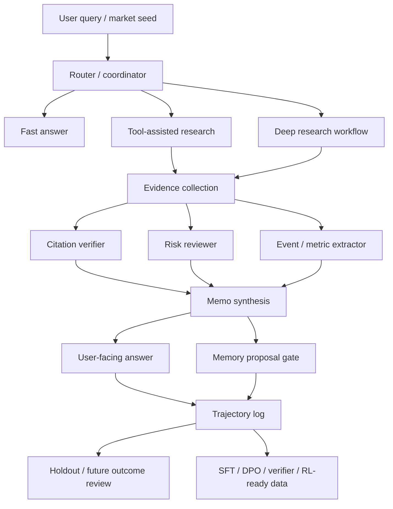

# KIWI Post-Training Portfolio Report - 2026-07-01

## One-Sentence Summary

KIWI is being rebuilt with post-training discipline: user requests, market
context, tool use, evidence spans, risk review, memory gates, and future outcome
checks are treated as structured, auditable trajectories before any GPU
fine-tuning is attempted.

## Interview Claim

We are not claiming to have completed large-scale RLHF, DPO, or GRPO. We are
claiming that we built the data and harness substrate that makes post-training
meaningful:

- structured task data for narrow specialists;
- realistic holdout evaluation;
- explicit failure taxonomy;
- point-in-time and source provenance contracts;
- real citation-span collection from auditable sources;
- CPU baselines used as a cheap sanity check before GPU work.

## System Shape

## Current Data Assets

| Asset | Purpose | Status |
| --- | --- | --- |
| `golden_v0.1` | first curated router/risk/citation data | imported |
| `kiwi-brain-ai-expanded-v0.1` | larger synthetic/expanded specialist corpus | imported |
| `router_contract_repair_v0.1c` | router label-contract repair | canonical checkpoint |
| `router_social_boundary_repair_v0.1` | candidate repair for social/bookmark narratives | kept as tradeoff run |
| `risk_contract_repair_v0.1` | risk schema repair with `medium` and human-gate labels | useful failed checkpoint |
| `citation_contract_repair_v0.1` | five-way citation support contract | active contract |
| `real_citation_spans_v0.1` | first real official-source citation span seed | collected, not training-ready |
| `report_and_filing_spans_v0.1` | next filing/transcript/public report span pack | planned |

## Key Results

Router repair:

| Holdout | Before | After `router_contract_repair_v0.1c` |
| --- | ---: | ---: |
| golden router | 0.3023 | 0.8895 |
| long research router | 0.4800 | 0.9600 |
| real tool trace pilot | 0.0000 | 1.0000 |

Risk repair:

| Eval | Accuracy | Macro F1 | Interpretation |
| --- | ---: | ---: | --- |
| internal dev | 0.9970 | 0.9622 | repair rows are learnable |
| internal test | 0.9928 | 0.9073 | schema works internally |
| golden risk holdout | 0.3923 | 0.3349 | realistic medium transfer failed |
| long research risk holdout | 0.0000 | 0.0000 | all medium rows predicted low |

Citation span seed:

| Label | Rows |
| --- | ---: |
| `verified_support` | 15 |
| `partial_support` | 6 |
| `insufficient` | 4 |
| `contradicts` | 4 |

The citation seed has 29 real paragraph/list/table-cell spans from AMD,
Microsoft, Micron, and NVIDIA sources. It stores source URLs, point-in-time
dates, source hashes, paragraph hashes, support labels, and no raw HTML dumps.

## Failure Taxonomy

| Failure mode | What happened | What changed |
| --- | --- | --- |
| Template leakage | expanded data made router/risk look too easy | added realistic holdouts |
| Missing label contract | router lacked `risk_review` and `clarification_needed` | added router contract repair |
| Candidate vs verified evidence ambiguity | topical evidence was overaccepted | separated five citation labels |
| Medium-risk transfer failure | risk model learned synthetic medium but failed real long-research medium | blocked GPU training; next build real medium rows |
| Source fetch instability | Micron IR timed out under scripted fetch | used issuer press-release mirror and recorded fallback |
| DOM extractor gap | AMD 8-K section text lived in `div/span` nodes | expanded extractor coverage |
| Dataset split bug | split labels were passed positionally to `SpanCase` | changed cases to explicit `split=...` |

## Why This Is Post-Training Relevant

Post-training is not just choosing PPO, DPO, or GRPO. For KIWI, the practical
post-training work is turning real financial research behavior into structured,
verifiable data:

- router rows become SFT/classifier data;
- citation rows become verifier/RM data;
- risk-review rows become safety/reviewer data;
- preference pairs become DPO data;
- tool trajectories become agentic SFT/RL data;
- future outcome reviews become noisy but useful post-hoc diagnostics.

The current artifact proves the first half of that loop: data contracts,
collection, repair, baselines, holdouts, and failure-driven iteration.

## What We Do Not Claim

- We do not claim production-grade investment advice.
- We do not claim a profitable trading policy.
- We do not use future returns as the sole reward.
- We do not train on paywalled sell-side report full text.
- We do not claim GRPO/DPO has already improved a deployed model.
- We do not treat social posts as ground truth.
- We do not start GPU fine-tuning when CPU holdouts reveal data-contract gaps.

## Next Work

1. Build `report_and_filing_spans_v0.1` from SEC filings, financial reports,
   transcripts, public reports, and reputable news.
2. Expand citation spans to 100+ audited rows.
3. Build `risk_contract_repair_v0.1b` from real long-research medium-risk rows.
4. Rerun CPU baselines and realistic holdouts.
5. Only then decide whether Qwen 0.5B/1.5B/3B LoRA SFT or DPO is worth running.
